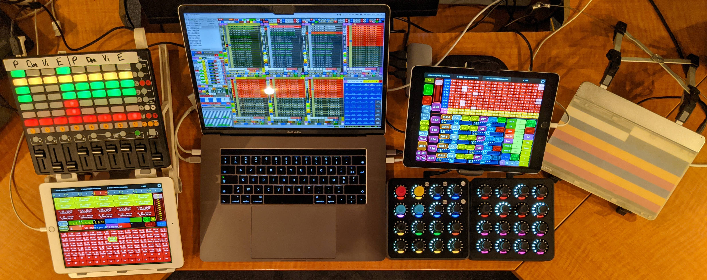
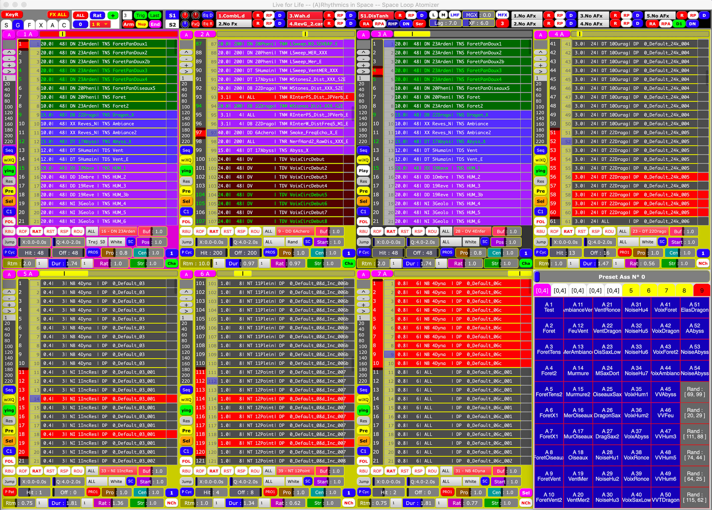
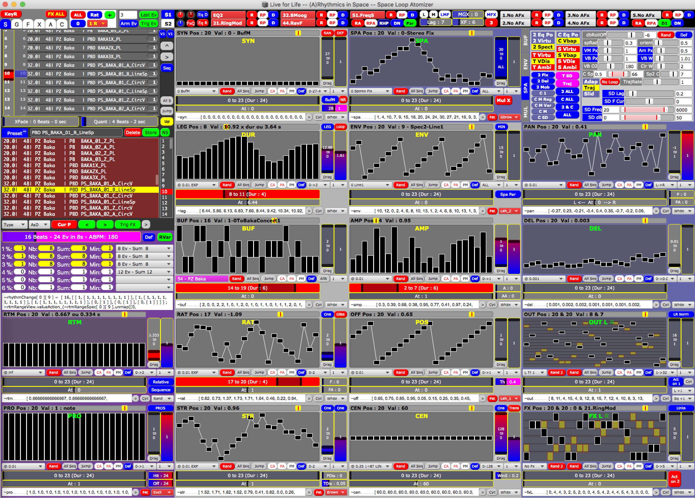

# Welcome to ***Live 4 Life*** ! &nbsp;&nbsp;  &nbsp;&nbsp;  &nbsp;&nbsp; 

| [**Overview**](#overview) | [**Usage**](#usage) | [**Installation**](#installation) | [**Setup**](#setup) | [**References**](#references) | [**Contribute**](#contribute) | [**Acknowledgements**](#acknowledgements) | [**Licence**](#licence) |

## Overview

PLEASE READ CAREFULLY THE [**USAGE**](#usage), INCLUDING PLATFORM SUPPORT, AND THE [**LICENCE**](#licence) BEFORE DOWNLOADING, INSTALLING OR USING THIS TOOL!

The **spatial performance tool** ***Live 4 Life*** aims to simplify the creation and control in real time of mass of spatialised sound objects on various kinds of loudspeaker configurations (particularly stereo, quadriphonic or octophonic setups, as well as domes of 16, 24 or 32 loudspeakers...) with several controllers (currently, you can control it with the GUI and the keyboard, and you can also add an [Akai APC Mini](https://www.akaipro.com/apc-mini), 2 tablets with [Lemur App](https://liine.net/en/products/lemur/), 2 [MIDI Fighter Twister](https://www.midifighter.com/#Twister) and a [Sensel Morph](https://morph.sensel.com)). 

I have been developing in [**SuperCollider**](https://supercollider.github.io) since 2011, "to play the place and the music at the same time". Currently, it is the only project I use to create with sounds and space. Although I hope to develop the tool with other spatial controls and algorithms during the rest of my life, rhythm and synthesis are now prioritized over spatial development, which is a bit paused because of several reasons (mainly due to the pandemic and the difficulty to find residencies or perform spatial improvisations in concert halls or festivals without an appropriate allowance).

**What makes the difference with other spatialisation tools ?**

1. It is not only a spatialisation tool, but **a whole sound creation system** to play with sequences of parameters (rhythm, sound and space), **integrating spatialisation at the heart of each sound synthesis and loudspeaker**.
2. Contrary to most tools with input/track-based spatialisation, it is **a layer- and event-based spatialisation,** where sequences of **spatialised sound particles or choruses** (copies or echoes of the same event with micro-delays or spectral/spatial variations) meet **a multichannel effect system**.
3. It includes **a library of different abstract and concrete spatialisation techniques and rendering algorithms** (see section 1.2 of [ICMC 2018 paper](https://quod.lib.umich.edu/cgi/p/pod/dod-idx/live-4-life-a-spatial-performance-tool-focused-on-rhythm.pdf?c=icmc;idno=bbp2372.2018.057;format=pdf) for definitions and the figure 4 of [ICMC 2021 paper](https://www.researchgate.net/publication/354526907_The_story_and_the_insides_of_a_spatial_performance_tool_Live_4_Life) for the details of the spatial structure), **mixing channel- and object-based paradigms** to be used on every sound event (to take advantage of the strengths of each approach). It has also the effect that sequences integrating channel-based or a multichannel effect system are different according to the number of loudspeakers available and cannot be reproduced in the same way on different loudspeaker configurations.
4. It is first thought for spatial performance with several **global, high-level (indirect) control strategies**, e.g. by swinging among scenes of spatialised events or by changing masses of parameters, particularly playback speeds with different mappings according to each controller (see section 3 of the [article in 2021 Organised Sound](https://doi.org/10.1017/S135577182100008X)). 

<b>The performance tool in context with all its controllers in 2021</b>
<!--<a href="#> <b>The performance tool in context with all its controllers</b> </a>   -->

<b>One of the views of the GUI to choose among dozens of sequences and global parameters</b>

<b>Another view of the GUI to compose sequences of parameters of spatialised sound events</b>

<!--

  <b>Some Links:</b> 
  <a href="#">Link 1</a> |
  <a href="#">Link 2</a> |
  <a href="#">Link 3</a>
    
  

-->

## Usage

Please note that:

* currently, the code can be incorrectly highlighted in Github due to a [bug](https://github.com/supercollider/language-supercollider/issues/4), but it is ok in SuperCollider.

* :warning: **it is currently designed for both Mac 15" specific screen size (1920×1200) and Mac 16" specific screen size (2056×1329) and an AZERTY keyboard (Français - Numérique). Scaling of the GUI and other keyboard options will be added in the future.**

* although the code is available here, the interface and the setup are relatively complex, as this tool is not meant to be a simple graphic user interface (GUI) for a casual, untrained user of SuperCollider, but focused to allow the creation of a lot of combinations tailored to my creative dreams to map sound with space of speakers.

* due to the fact I almost began learning SuperCollider with this experimental project and that I am not a professional developer, the code is relatively raw with lots of old comments and I have developed over time my own coding strategies, which might be old, bad or unoptimised. Even though there may be some bugs or errors, particularly during the setup process (causing to reboot), the tool generally works well for me with my workflow during performances. But I cannot guarantee it will work for you the way you want.

* changing drastically effect parameters can produce very loud sounds. So, monitor the volume and change sliders and parameters slowly if you do not know the effect or what (kind of parameter) you are changing.

### Platform support

***Live 4 Life* has been mainly tested with macOS 10.14.6 Mojave on a MacBook Pro 15" and the GUI has been adapted for macOS 12.6 Monterey on a MacBook Pro M1 16".**

**It has also been tested on Linux and works considering that you have a minimum resolution of 1920×1200 or a little bit higher.** The reason why I do not switch from Mac to Linux is that I often used [Dante](https://www.audinate.com/products) to send multiple channels via ethernet in some concert halls. Since Dante virtual sound cards are not available for linux, you need to buy specific expensive sound cards to use Dante.

**For Windows, I do not know. Let me know if you can.**

## Installation

Follow the steps below one after another:

1. Install [SuperCollider 3.13](https://supercollider.github.io/downloads) or above. 
2. Put [sc3-plugins](https://supercollider.github.io/sc3-plugins#insrallation) in your SuperCollider Extensions folder (go in the menu `File -> Open user support directory`. Create a folder named `Extensions`, if it is not already there, and put your plugins folder into it).
3. Install [the Quarks](https://github.com/supercollider-quarks/quarks#installing-a-quark) mentioned below (go in the menu `Language -> Quarks`, click on the button `Check for updates` and select the quarks) and recompile:

	- [adclib](https://github.com/supercollider-quarks/adclib) (for adcVerb),
	- [atk-sc3](https://github.com/ambisonictoolkit/atk-sc3) (for ambisonic spatialisation: currently only FOA is used, HOA-ATK will be updated in the future. **Install also [ATK dependencies](https://github.com/ambisonictoolkit/atk-sc3/blob/master/README.md#kernels-matrices--soundfiles), i.e. Kernels and Matrices.** This Quark will also install automatically other Quarks, like e.g. [wslib](https://github.com/supercollider-quarks/wslib) for GUI, [Mathlib](https://github.com/supercollider-quarks/MathLib) or [XML](https://github.com/supercollider-quarks/XML).),
	- [Automation](https://github.com/neeels/Automation) (for saving and recalling actions on main GUIs),
	- [Bjorklund](https://github.com/redFrik/Bjorklund) (for Euclidean algorithm),
	- [Connection](https://github.com/scztt/Connection.quark) (for [MVC](https://en.wikipedia.org/wiki/Model–view–controller) and NumericControlValue),
	- [crucialviews](https://github.com/crucialfelix/crucialviews) (for GUI BoxMatrix),
	- [Ctk](https://github.com/supercollider-quarks/Ctk) (for Sam Potter extensions and chaotic envelopes),
	- [FPLib](https://github.com/miguel-negrao/FPLib) (for functional programming to get back to previous presets. This Quark will also install automatically [JITLibExtensions](https://github.com/supercollider-quarks/JITLibExtensions) and [Modality-toolkit](https://github.com/ModalityTeam/Modality-toolkit) for some MIDI controllers: if you have the controller [MIDI TouchBar](https://urbanlienert.com/miditouchbar) on previous MacBook Pros or the UC-33 MIDI controller, put the files available within the folder [`Modality_desc_to_add`](Controllers/Modality_desc_to_add) in the folder `MKtlDescriptions` within the Quark [Modality](https://github.com/ModalityTeam/Modality-toolkit/tree/master/Modality).),
	- ([KMeans](https://github.com/supercollider-quarks/KMeans)),
	- [PopUpTreeMenu](https://github.com/redFrik/PopUpTreeMenu) (for GUI),
	- ([redSampler](https://github.com/redFrik/redSampler): not necessary; I only use it to play specific sound files.),
	- [SC-Grids](https://github.com/capital-G/sc-grids) (to play with a topographic drum sequencer from the Eurorack module [Grids](https://mutable-instruments.net/modules/grids/manual/) ported first in C++ by [Mutable Instruments](https://github.com/pichenettes) and then to SuperCollider by [Dennis Scheiba](https://github.com/capital-G). You can install it via `Quarks.install("https://github.com/capital-G/sc-grids")`. It is currently available only in the main version of the code and will be updated in the latest release later.),
	- [SpeakersCorner](https://github.com/supercollider-quarks/SpeakersCorner) (for GUI),
	- [TabbedView](https://github.com/jmuxfeldt/TabbedView) (deprecated, but necessary for GUI [wslib](https://github.com/supercollider-quarks/wslib)'s MasterEQ),
	- [TabbedView2](https://github.com/jmuxfeldt/TabbedView2) (for GUI),
	- [TabbedView2_QT](https://github.com/jmuxfeldt/TabbedView2_QT) (for GUI),
	- [Twister](https://github.com/scztt/Twister.quark) (you have to install it, even if you don't have a MIDI Fighter Twister controller; since it is not in the Quarks directory, you can install it via `Quarks.install("https://github.com/scztt/Twister.quark")`.),
	- [Unit-Lib](https://github.com/GameOfLife/Unit-Lib) (for the 2D trajectory editor),
	- [WFSCollider-Class-Library](https://github.com/GameOfLife/WFSCollider-Class-Library) (for the 2D trajectory editor),
	- [WarpExt](https://github.com/supercollider-quarks/WarpExt) (for warp synths),
	- [WindowHandleView](https://github.com/scztt/WindowHandleView.quark) (for GUI),
	- [ZArchive](https://github.com/crucialfelix/ZArchive) (for saving and recalling presets).

4. Put the files of the folder [`L4L_Extensions`](/L4L_Extensions) in your `Extensions` folder (if you do not already have these classes) and recompile again.

## Setup

The code does not take the form of a SuperCollider quark (i.e. external library) or classes, since I would have been unable to build this tool if I had to recompile the programme each time I had to change the code. Due to this experimental nature based on trial and error, it consists of environment variables collecting arrays, dictionaries and functions mainly spread in three big files within the folder [`L4L_Project`](/L4L_Project): [`_1_Init_BuffersSynths_130.scd`](/L4L_Project/_1_Init_BuffersSynths_130.scd), [`_2_Init_GUI_222.scd`](/L4L_Project/_2_Init_GUI_222.scd), [`_3_Init_Pattern_182.scd`](/L4L_Project/_3_Init_Pattern_182.scd).

In order to launch the tool, simply follow the steps of the file [`_0_Init_Live4Life.scd`](/L4L_Project/_0_Init_Live4Life.scd) in the folder [`L4L_Project`](/L4L_Project) in order to:

1. [define and evaluate default configuration parameters](L4L_Project/_0_Init_Live4Life.scd#L1-L102). You mainly have to :warning: **choose the [absolute path of your sound folder](L4L_Project/_0_Init_Live4Life.scd#L39)** (As mentioned below, I have already prepared a structured sound folder to download. To know exactly the path, you can drag the folder into your SuperCollider IDE.) and your [spatial configuration and distribution of loudspeakers](L4L_Project/_0_Init_Live4Life.scd#L42-L64) (stereo, quad, circles of 5, 7, 8 loudspeakers, or domes of 16, 24, 32 loudspeakers) or define it by code with `~numChannelsConfig` in the file [`_1_Init_BuffersSynths_130.scd`](/L4L_Project/_1_Init_BuffersSynths_130.scd) if not available.

2. [evaluate a function](L4L_Project/_0_Init_Live4Life.scd#L126) and [load one](L4L_Project/_0_Init_Live4Life.scd#L130) or [two servers](L4L_Project/_0_Init_Live4Life.scd#L134):

	1. initialising a collection of thousands of synthDefs, with a few dozen synthesis types for each envelope type and for each spatial algorithm and a library of trajectories for some algorithms. **(For each new specific spatial configuration, two folders of synthDefs are created the first time in SuperCollider user support directory; the next times, scsyndef files will be more quickly loaded. 
:warning: If you get an error — which might happen more or less given your computer and spatial setup — the first time when you create the folder of synthDefs, delete the folders for each of the 2 servers created, reboot the server and start from step 1 again.)**

	2. initialising a collection of thousands of mono and stereo buffers of max. 2 GB, hierarchically organised by category in dozens of folders (To play easily with sound files, prepare one folder gathering a collection of subfolders labelled e.g. like: `DL 1Kick`, `DM 2Snare`, `DH 3Hat`, `EL Earth`, `EM Water` `EH Fire`, `IL Bass`, `IM Gong`, `IH Piano` ..., containing dozens of sound files. The first two letters allow to gather together the categories of folders for each of the letter, e.g. the first letter `D` for Drums, `E` for sounds of the elements, `I` for instruments, and the second letter `L`, `M`, or `H` for e.g. a specific color or register. **To speed up setup and creation process, I have prepared in this [folder to download a collection of sounds](https://github.com/Xon77/L4LSoundsDataBase/tree/main/SoundFolder)** — to expand and improve — including drum machine sounds specifically sorted for this tool. This process may take a few minutes depending on the size of the sound library and your computer.),

3. [open a GUI](L4L_Project/_0_Init_Live4Life.scd#L144) (this process may take a dozen seconds) with different tabs like a Sequence view for the composition and the Global view for the performance (see figures above), as well as views for global multichannel and ambisonic effects,

4. [evaluate a pattern function](L4L_Project/_0_Init_Live4Life.scd#L154), that triggers sound events with sequences of parameters for each track, and a routine updating the GUI.

5. You can now play the first track by clicking on the green button in the control panel at the left of the window, and experiment by changing parameter modules (see [ICMC 2021 paper](https://www.researchgate.net/publication/354526907_The_story_and_the_insides_of_a_spatial_performance_tool_Live_4_Life)). To configure the keyboard or other MIDI or OSC controllers, check the corresponding files in the folder [Controllers](/Controllers) for full performance control.

A **[wiki (in construction)](https://github.com/Xon77/Live4Life/wiki)**, including tutorials and code examples to automate some utility functions will be added over time, as well as training workshops in immersive sound and spatial improvisation.

## References

***Live 4 Life*** has been presented several times during conferences ([JIM 2017](https://jim2017.sciencesconf.org/data/Lengele2017aa.pdf), [ICMC 2018](https://quod.lib.umich.edu/cgi/p/pod/dod-idx/live-4-life-a-spatial-performance-tool-focused-on-rhythm.pdf?c=icmc;idno=bbp2372.2018.057;format=pdf), [ICMC 2021](https://www.researchgate.net/publication/354526907_The_story_and_the_insides_of_a_spatial_performance_tool_Live_4_Life)), concerts (ICMC 2018, [JIM 2019](https://www.youtube.com/watch?v=NfWXF6copEs)), festivals (Ultrasons from 2016 to 2021, [video of Akousma 2021](https://player.vimeo.com/video/747391295?autoplay=1#t=1h21m40s), [Cube Fest 2022](https://artscenter.vt.edu/performances/cube-fest-2022.html)), or in the  Journal of Music and Technology [Organised Sound](https://doi.org/10.1017/S135577182100008X) (April 2021).

All the papers are also published on [ResearchGate](https://www.researchgate.net/profile/Christophe-Lengele) or [ORCID](https://orcid.org/my-orcid?orcid=0000-0002-9114-6632), as well as my [doctoral thesis](https://www.researchgate.net/publication/360018268_L'improvisation_spatiale_generee_a_partir_de_motifs_polyrythmiques_et_de_sequences_de_parametres_en_boucle_via_l'outil_de_performance_Live_4_Life) (in french, sorry) funded by the [FRQSC](https://frq.gouv.qc.ca/en/society-and-culture/), about spatial improvisations based on polyrhythms and sequences of parameters in loop via this tool.

Several performances are available either on [YouTube](https://www.youtube.com/channel/UCOv5kb3IQBmgyOQPu5DOZ4g) or [Vimeo](https://vimeo.com/christophexon).

## Contribute

I have a lot of features I would like to improve or develop, such as the collection of synthDefs (with e.g. [some mutable instruments eurorack modules](https://github.com/v7b1/mi-UGens/tree/v0.0.1) or [plugins from Mads Kjeldgaard](https://github.com/madskjeldgaard/portedplugins)), as well as HOA (currently only FOA).

If you would like to contribute, please get in touch with me in order to organise further development. The code management or installation process can be greatly improved, but for now I prefer to focus on rhythmic music features and performance.

Feel free to post an issue, and you can also send me a mail first since it might be a functionality not explained (a more complete wiki will come), or try to send a pull request, since depending on my priorities I may not have not the time or the ability to solve it.

For my current postdoctoral internship at [UQÀM](https://eavm.uqam.ca) funded by the [FRQSC](https://frq.gouv.qc.ca/en/society-and-culture/) from September 2022 until August 2024, **I am looking for (audio)visual collaborations for the creation of spatial improvisations** in a multi-sensory context, combining and alternating music, video / light and dance in space, mainly with:
- **video developers** to create the visual from the sound data generated. Technically, the audiovisual object mapping could be developed through open source tools, such as Processing (basic patch soon to be released), Open Frameworks, Hydra, or even through commercial tools like Touch Designer (basic patch soon to be released) and Resolume, **as long as the creation process and the code are published on Github and open to everyone**. 
- **dancers** for improvising to finally assess the impact between the gesture of the performer, the dancing bodies and the video / light environment. I am particularly interested in mixing traditional dances like **Gigue from Québec** with contemporary forms.

The themes of these spatial improvisations will be about: **loneliness and love, Bernard Parmegiani and Francis Dhomont, free party, (hardcore) techno music and tradition**. Feel free to contact me if you are interested.

<mark> You can also support thanks to donations via [**Ko-fi**](https://ko-fi.com/live4life) or get specific support and courses via [**Patreon**](https://www.patreon.com/live4life)</mark>. :grin:

<!-- 

-->

<!-- Introduire un bouton Patreon
https://shieldsio-patreon.vercel.app
https://github.com/endel/shieldsio-patreon/blob/master/README.md
-->

<!-- Introduire un gif...

-->

## Acknowledgements

***Live 4 Life*** grew little by little, by gluing and restructuring a lot of code from others and integrating several systems and quarks. **I would have been unable to build this tool without the help of the SuperCollider online community, who always answered my questions and even provided me with some examples of codes and classes.**

**So, Big Thanks to** (including previous and current developers):

[James Harkins](https://github.com/jamshark70), [Daniel Mayer](https://github.com/dkmayer), [Fredrik Olofsson](https://github.com/redFrik), [Julian Rohrhuber](https://github.com/telephon), [Josh Parmenter](https://github.com/joshpar), [Wouter Snoei](https://github.com/woutersnoei), [Nick Collins](https://github.com/sicklincoln), [Jakob Leben](https://github.com/jleben), [Chris Sattinger](https://github.com/crucialfelix), [Dan Stowell](https://github.com/danstowell), [Scott Wilson](https://github.com/muellmusik), [Joseph Anderson](https://github.com/joslloand), [Miguel Negrão](https://github.com/miguel-negrao), [Scott Carver](https://github.com/scztt), [Alberto de Campo](https://github.com/adcxyz), [Marije Baalman](https://github.com/sensestage), [Brian Heim](https://github.com/mossheim), [Marcin Pączkowski](https://github.com/dyfer) ...

The list might be long. Sorry for those I forgot to mention. I cannot quote all of them.

By giving soon this tool, it is my way to contribute to SuperCollider.
And I encourage anyone (DSP developers or any user) to support and use this beautiful environment.

## Licence

© 2011-2023 Christophe Lengelé

***Live 4 Life*** is an open source software: you can redistribute it and/or modify it under the terms of **Creative Commons Attribution-NonCommercial-ShareAlike 4.0 International license** (CC BY-NC-SA 4.0). 

:warning: **You may not use it for commercial purposes.**

This program is distributed in the hope that it will be useful, but WITHOUT ANY WARRANTY. 

**I wish it would be used in the spirit of [*Free Party*](https://en.wikipedia.org/wiki/Free_party)**. Unfortunately, *Free* does not mean free in this commercial world, but invites to contribute to the costs and labor according to one's ability to give. I do not want this tool to be used, by any means, for personal profit.

:warning: **Moreover, I do not want that this tool to be used by or in [Société des Arts Technologiques](https://sat.qc.ca)** and its Metalab without my consent, since this organisation never helped me in diffusing my spatial creations in their dome despite my proposals. This restriction will be withdrawn only if I have the opportunity to play improvisations in their dome.

See the [License](/LICENCE.md) for more details.
