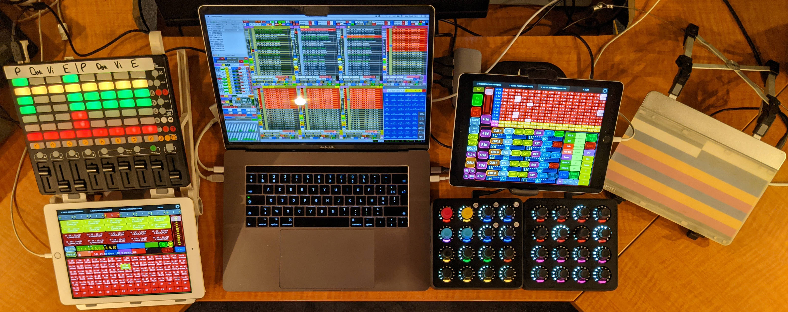
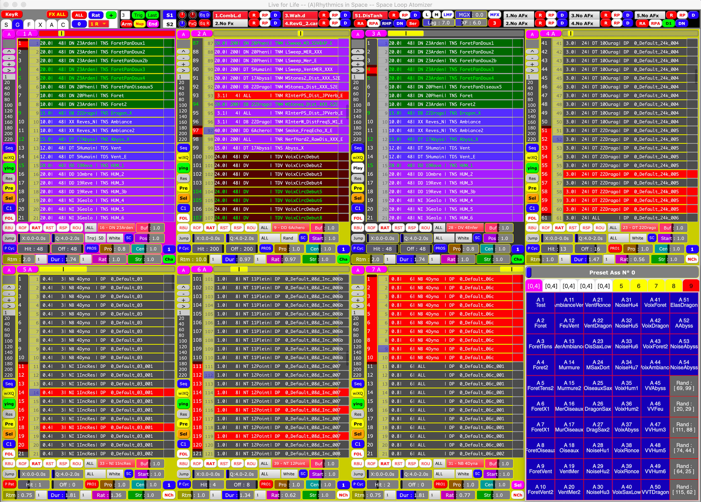

# Welcome to *Live 4 Life* ! To come soon ! &nbsp;&nbsp; 

| [**Overview**](#overview) | [**Usage**](#usage) | [**Requirements**](#requirements) | [**Installation**](#installation) | [**References**](#references) | [**Contribute**](#contribute) | [**Acknowledgements**](#acknowledgements) | [**Licence**](#licence) |

## Overview

The **spatial performance tool** *Live 4 Life*, which is in constant development under the Mac platform, aims to simplify the creation and control in real time of mass of spatialised sound objects on various kinds of loudspeaker configurations (particularly stereo, quadriphonic or octophonic setups, as well as domes of 16, 24 or 32 loudspeakers...). 

I have been developing in **SuperCollider** since 2011, "to play the place and the music at the same time".

<b>The performance tool in context with all its controllers in 2021</b>
<!--<a href="#> <b>The performance tool in context with all its controllers</b> </a>   -->

<b>One of the views of the GUI to choose among dozens of sequences and global parameters</b>

<b>Another view of the GUI to compose sequences of parameters of spatialised sound events</b>

<!--

  <b>Some Links:</b> 
  <a href="#">Link 1</a> |
  <a href="#">Link 2</a> |
  <a href="#">Link 3</a>
    
  

-->

## Usage

:warning: Please note that:

* although the code is available here, the interface and the setup are relatively complex, as this tool is not meant to be a simple graphic user interface (GUI) for a casual, untrained user of SuperCollider, but focused to allow the creation of a lot of combinations tailored to my creative dreams.

* it is designed for a specific screen size (1920×1200) and an AZERTY keyboard.

* ...

### Platform support

*Live 4 Life* has only been tested with macOS 10.14.6 Mojave on a MacBook Pro 15". 
It will soon be optimized for MacOS M1 16".

The reason why I do not switch from Mac to Linux is that I often used [Dante](https://www.audinate.com/products) to send multiple channels via ethernet in some concert halls. Since Dante virtual sound cards are not available for linux, you need to buy specific expensive sound cards to use Dante.

It might work for Linux and Windows platforms after solving some issues. 
Several years ago, I succeeded to make it work on Linux: I remember I had to change and limit `numWireBufs_` to some values, like 800, in the file `1_Init Buffer Synths`, since MacOS seem to accept very high values without generating errors. Since then, there may probably be other errors on Linux.
For Windows, I do not know, since currently I do not have a simple access to both of them.
Let me know. I might maybe help.

## Requirements

* [SuperCollider 3.12.1](https://supercollider.github.io/download) or above

* [sc3-plugins](https://supercollider.github.io/sc3-plugins/)

* many [Quarks](https://github.com/supercollider-quarks):
  - [adclib](https://github.com/supercollider-quarks/adclib) (for adcVerb)
  - [atk-sc3](https://github.com/ambisonictoolkit/atk-sc3) (for ambisonic spatialisation - currently only FOA, HOA will be updated in the future)
  - [Bjorklund](https://github.com/redFrik/Bjorklund) (for euclidean algorhythm)
  - [Connection](https://github.com/scztt/Connection.quark) (for MVC and NumericControlValue)
  - [Ctk](https://github.com/supercollider-quarks/Ctk) (for Sam Potter extensions and chaotic envelopes)
  - [FPLib](https://github.com/miguel-negrao/FPLib) (functional programming to get back to previous presets)
  - [Modality-toolkit](https://github.com/ModalityTeam/Modality-toolkit) (for some MIDI controllers)
  - [PopUpTreeMenu](https://github.com/redFrik/PopUpTreeMenu) (for GUI)
  - ([redSampler](https://github.com/redFrik/redSampler), not necessary, I only use it to play specific sound files)
  - [ServerTools](https://github.com/supercollider-quarks/ServerTools)(for server status)
  - [SpeakersCorner](https://github.com/supercollider-quarks/SpeakersCorner) (for GUI)
  - [TabbedView2](https://github.com/jmuxfeldt/TabbedView2) (for GUI)
  - [TabbedView2_QT](https://github.com/jmuxfeldt/TabbedView2_QT) (for GUI)
  - [Twister](https://github.com/scztt/Twister.quark) (for MIDI Fighter Twister controllers)
  - [Unit-Lib](https://github.com/GameOfLife/Unit-Lib) (for trajectory editor of the modified version of [WFSCollider-Class-Library](https://github.com/GameOfLife/WFSCollider-Class-Library), available within the [folder](/4Live4Life_Extensions) `4Live4Life_Extensions`.
  - [WarpExt](https://github.com/supercollider-quarks/WarpExt) (for warp synths)
  - [wslib](https://github.com/supercollider-quarks/wslib) (for GUI)
  - [ZArchive](https://github.com/crucialfelix/ZArchive) (for saving and recalling presets)

Concerning some extensions,  [APCmini](https://github.com/andresperezlopez/APCmini)

## Installation

1. Install SuperCollider. 
2. Put sc3-plugins in your SuperCollider Extensions folder.
3. Install all the Quarks mentionned above.

## Contribute

## References

*Live 4 Life* has been presented many times during conferences ([JIM 2017](https://jim2017.sciencesconf.org/data/Lengele2017aa.pdf), [ICMC 2018](https://quod.lib.umich.edu/cgi/p/pod/dod-idx/live-4-life-a-spatial-performance-tool-focused-on-rhythm.pdf?c=icmc;idno=bbp2372.2018.057;format=pdf), [ICMC 2021](https://www.researchgate.net/publication/354526907_The_story_and_the_insides_of_a_spatial_performance_tool_Live_4_Life)), concerts (ICMC 2017, [JIM 2019](https://www.youtube.com/watch?v=NfWXF6copEs)), festivals (Ultrasons from 2016 to 2021, Akousma 2021), or in the  Journal of Music and Technology [Organised Sound](https://doi.org/10.1017/S135577182100008X).

All the papers are also published on [Researchgate](https://www.researchgate.net/profile/Christophe-Lengele), as well as my doctoral thesis, soon to be published (in french, sorry) about realtime creation of spatialised polyrhythms via this tool.

Several performances are available either on [YouTube](https://www.youtube.com/channel/UCOv5kb3IQBmgyOQPu5DOZ4g) or [Vimeo](https://vimeo.com/christophexon).

## Acknowledgements

## Licence

© 2011-2021 Christophe Lengelé

*Live 4 Life* is an open source software: you can redistribute it and/or modify it under the terms of **Creative Commons Attribution-NonCommercial-ShareAlike 4.0 International license** (CC BY-NC-SA 4.0). 

You may **not** use it for commercial purposes.

This program is distributed in the hope that it will be useful, but WITHOUT ANY WARRANTY. 

I wish it would be used in the spirit of *Free Party*. Unfortunately, *Free* does not mean free in this commercial world, but invites to contribute to the costs and labor according to one's ability to give. I do not want this tool to be used, by any means, for personal profit.

Moreover, I would **not** like that this tool to be used by [Société des Arts Technologiques](https://sat.qc.ca) without my consent, since this organization never helped me in diffusing my spatial creation and research despite my proposals. If these wishes are not respected, your souls will be damned for eternity.

See the [License](/LICENCE.md) for more details.
